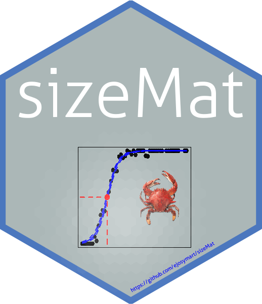

---
output:
  md_document:
    variant: gfm
---

```{r, echo = FALSE}
knitr::opts_chunk$set(
  collapse = TRUE,
  comment = "#>",
  fig.path = "README-"
)
library(sizeMat)
```


# sizeMat

<br>

<!-- badges: start -->
[](commits/master) [](http://cran.r-project.org/package=sizeMat) [](http://cran.rstudio.com/web/packages/sizeMat/index.html) [](https://cran.r-project.org/)

<!-- badges: end -->
</a>

<hr>

**Estimate Size at Sexual Maturity**

This package allows to estimate Size at Morphometric and Gonadal Maturity for organisms, usually fish and invertebrates.

The estimation of morphometric maturity used two allometric variables and is based on the relative growth.

The estimation of gonadal maturity used one allometric variable and the stage of sexual maturity (gonad maturation stage).


## Install


Get the released version from CRAN:

```R
install.packages("sizeMat")
```

Or the development version from github:

```R
# install.packages("devtools")
devtools::install_github("ejosymart/sizeMat")
```


## Examples

This is a basic example which shows you how to estimate Size at Morphometric and Gonad Maturity:

## Size at Morphometric Maturity

```{r}
data(crabdata)

classify_data = classify_mature(crabdata, varNames = c("carapace_width", "chela_height"), 
                                varSex = "sex_category", selectSex = NULL, method = "ld")

print(classify_data)


my_ogive = morph_mature(classify_data, method = "fq")

print(my_ogive)


```


## Size at Gonad Maturity

```{r}
data(matFish)

my_ogive = gonad_mature(matFish, varNames = c("total_length", "stage_mat"), 
                        inmName = "I", matName = c("II", "III", "IV"), method = "fq", niter = 999)

print(my_ogive)

```
