# sizeMat

<!-- badges: start -->

[](https://github.com/ejosymart/sizeMat)
[](https://cran.r-project.org/package=sizeMat)
[](https://cran.r-project.org/package=sizeMat)
[](https://cran.r-project.org/package=sizeMat)
[](https://cran.r-project.org/)
<!-- badges: end -->

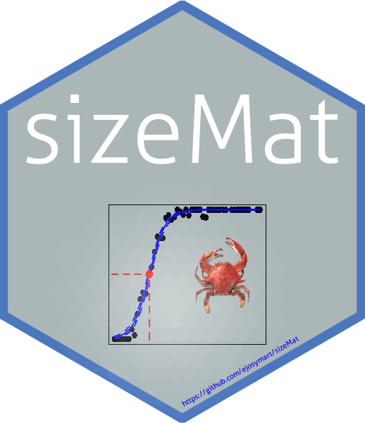

**Estimate Size at Sexual Maturity**

`sizeMat` is an R package for estimating size at morphometric and
gonadal maturity in organisms, especially fish and invertebrates.

The package includes tools for:

- classifying individuals into juvenile and adult groups using relative
  growth;
- estimating size at morphometric maturity;
- estimating size at gonadal maturity;
- fitting maturity ogives using frequentist or Bayesian logistic
  regression;
- visualizing results using base R graphics or optional `ggplot2`-style
  plots.

The size at sexual maturity is commonly expressed as $`L_{50}`$, the
size at which an individual has a 50% probability of being mature.

## Installation

Install the released version from CRAN:

``` r
install.packages("sizeMat")
```

Install the development version from GitHub:

``` r
# install.packages("devtools")
devtools::install_github("ejosymart/sizeMat")
```

## Example 1: Size at morphometric maturity

The morphometric maturity workflow has two main steps:

1.  classify individuals as juveniles or adults using two allometric
    variables;
2.  estimate the maturity ogive and $`L_{50}`$.

``` r
data(crabdata)

classify_data <- classify_mature(
  crabdata,
  varNames = c("carapace_width", "chela_height"),
  varSex = "sex_category",
  selectSex = NULL,
  method = "ld"
)
#> all individuals were used in the analysis

print(classify_data)
#> Number in juvenile group = 83 
#> 
#> Number in adult group = 140 
#> 
#> -------------------------------------------------------- 
#> 1) Linear regression for juveniles 
#> 
#> Call:
#> glm(formula = y ~ x, data = juv)
#> 
#> Coefficients:
#>              Estimate Std. Error t value Pr(>|t|)    
#> (Intercept) -3.794687   0.497056  -7.634 3.93e-11 ***
#> x            0.161327   0.004701  34.314  < 2e-16 ***
#> ---
#> Signif. codes:  0 '***' 0.001 '**' 0.01 '*' 0.05 '.' 0.1 ' ' 1
#> 
#> (Dispersion parameter for gaussian family taken to be 0.7320842)
#> 
#>     Null deviance: 921.306  on 82  degrees of freedom
#> Residual deviance:  59.299  on 81  degrees of freedom
#> AIC: 213.63
#> 
#> Number of Fisher Scoring iterations: 2
#> 
#> -------------------------------------------------------- 
#> 2) Linear regression for adults 
#> 
#> Call:
#> glm(formula = y ~ x, data = adt)
#> 
#> Coefficients:
#>               Estimate Std. Error t value Pr(>|t|)    
#> (Intercept) -11.246726   1.199496  -9.376   <2e-16 ***
#> x             0.273837   0.008648  31.663   <2e-16 ***
#> ---
#> Signif. codes:  0 '***' 0.001 '**' 0.01 '*' 0.05 '.' 0.1 ' ' 1
#> 
#> (Dispersion parameter for gaussian family taken to be 2.265729)
#> 
#>     Null deviance: 2584.24  on 139  degrees of freedom
#> Residual deviance:  312.67  on 138  degrees of freedom
#> AIC: 515.79
#> 
#> Number of Fisher Scoring iterations: 2
#> 
#> -------------------------------------------------------- 
#> 3) Difference between slopes (ANCOVA) 
#>               Estimate  Std. Error   t value     Pr(>|t|)
#> (Intercept) -3.7946869 0.757105677 -5.012097 1.109526e-06
#> x            0.1613275 0.007161179 22.528064 6.035478e-59
#> mature      -7.4520389 1.285219562 -5.798261 2.320729e-08
#> x:mature     0.1125093 0.010361046 10.858878 2.956242e-22
#> [1] "slopes are different"
```

### Base R plot

By default, `plot.classify()` uses base R graphics.

``` r
plot(
  classify_data,
  xlab = "Carapace width (mm)",
  ylab = "Chela height (mm)"
)
```

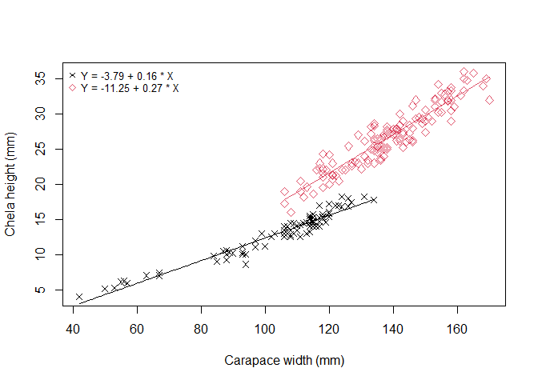

### ggplot2-style plot

Use `gg_style = TRUE` to return a `ggplot` object.

``` r
plot(
  classify_data,
  xlab = "Carapace width (mm)",
  ylab = "Chela height (mm)",
  col = c("steelblue", "firebrick"),
  pch = c(16, 17),
  gg_style = TRUE
)
```

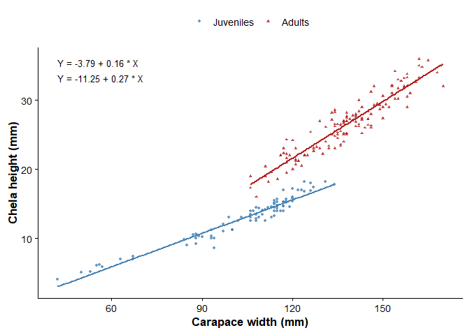

Because the output is a `ggplot` object, it can be modified using
`ggplot2`.

``` r
p_classify <- plot(
  classify_data,
  xlab = "Carapace width (mm)",
  ylab = "Chela height (mm)",
  col = c("steelblue", "firebrick"),
  pch = c(16, 17),
  gg_style = TRUE
)

p_classify +
  ggplot2::theme_bw()
```

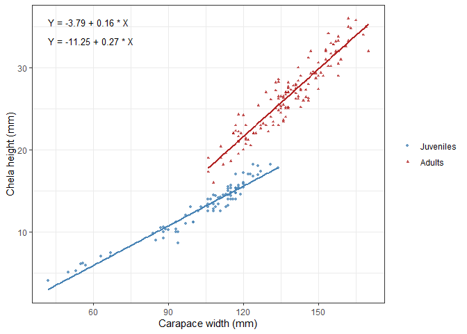

### Estimate morphometric maturity

``` r
set.seed(123)

my_morph <- morph_mature(
  classify_data,
  method = "fq",
  niter = 200
)

print(my_morph)
#> formula: Y = 1/1+exp-(A + B*X)
#>     Original Bootstrap (Median)
#> A   -20.753  -21.086           
#> B   0.1748   0.1762            
#> L50 118.7237 118.6442          
#> R2  0.7111   -
```

### Base R maturity ogive

``` r
plot(
  my_morph,
  xlab = "Carapace width (mm)",
  ylab = "Proportion mature",
  col = c("blue", "red"),
  onlyOgive = TRUE
)
```

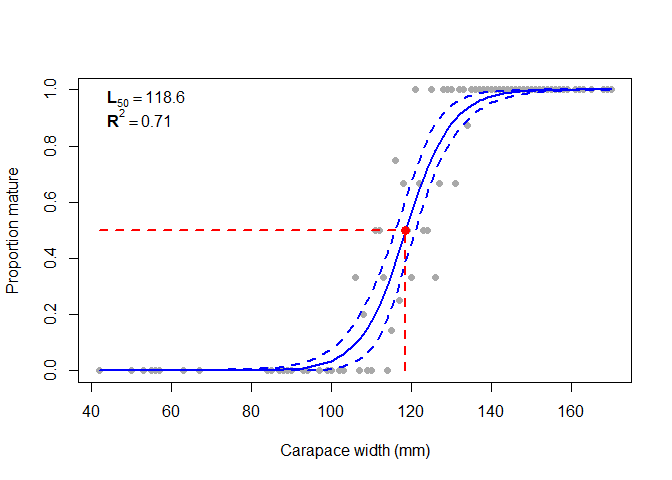

    #> Size at morphometric maturity = 118.6 
    #> Confidence intervals = 116 - 121 
    #> Rsquare = 0.71

### ggplot2-style maturity ogive

``` r
plot(
  my_morph,
  xlab = "Carapace width (mm)",
  ylab = "Proportion mature",
  col = c("steelblue", "firebrick"),
  onlyOgive = TRUE,
  gg_style = TRUE
)
#> Size at morphometric maturity = 118.6 
#> Confidence intervals = 116 - 121 
#> Rsquare = 0.71
```


When `gg_style = TRUE` and `onlyOgive = FALSE`, the plot method returns
a list of independent `ggplot` objects.

``` r
p_morph <- plot(
  my_morph,
  xlab = "Carapace width (mm)",
  ylab = "Proportion mature",
  col = c("steelblue", "firebrick"),
  gg_style = TRUE
)
#> Size at morphometric maturity = 118.6 
#> Confidence intervals = 116 - 121 
#> Rsquare = 0.71

names(p_morph)
#> [1] "A"     "B"     "L50"   "ogive"
```

Each plot can be displayed separately.

``` r
p_morph$A
```

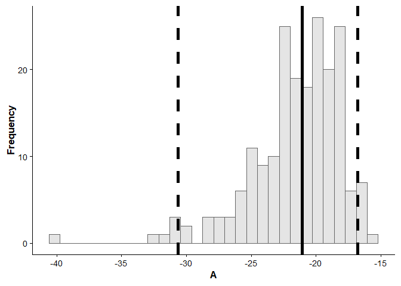

``` r
p_morph$B
```

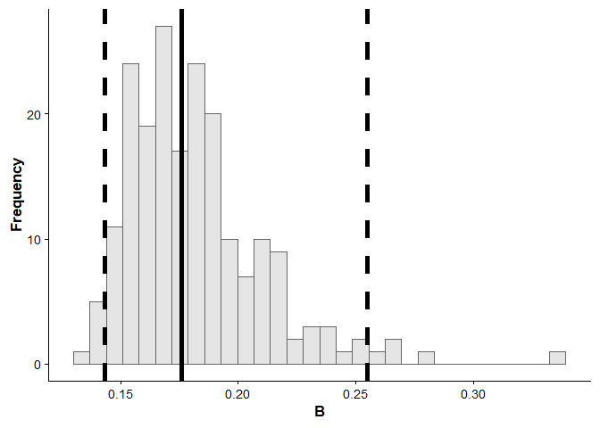

``` r
p_morph$L50
```

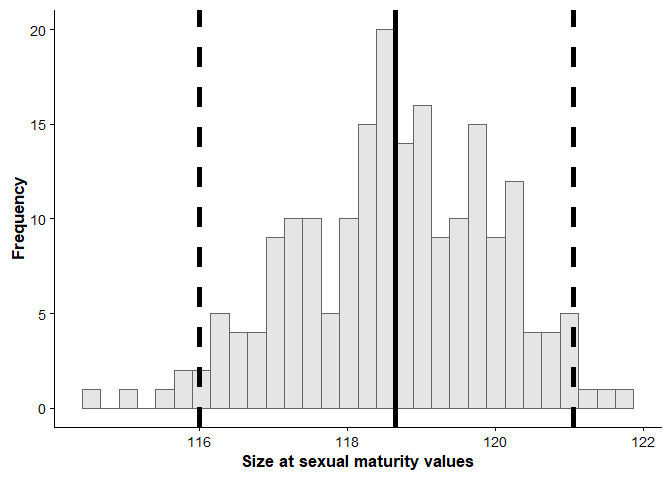

``` r
p_morph$ogive
```

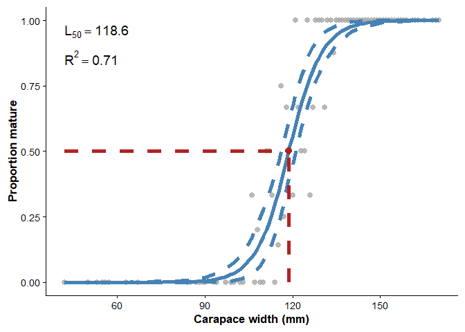

The returned plots can also be modified using standard `ggplot2` syntax.

``` r
p_morph$ogive +
  ggplot2::theme_bw() +
  ggplot2::ggtitle("Morphometric maturity ogive")
```

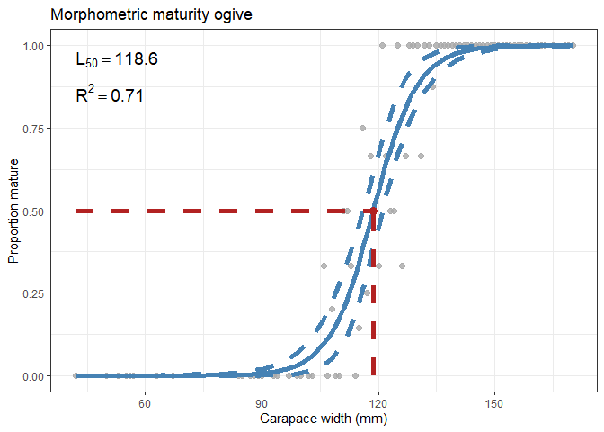

## Example 2: Size at gonadal maturity

The gonadal maturity workflow uses one allometric variable and a
maturity stage variable.

``` r
data(matFish)

set.seed(123)

my_gonad <- gonad_mature(
  matFish,
  varNames = c("total_length", "stage_mat"),
  immName = "I",
  matName = c("II", "III", "IV"),
  method = "fq",
  niter = 200
)

print(my_gonad)
#> formula: Y = 1/[1+exp-(A + B*X)]
#>     Original Bootstrap (Median)
#> A   -8.6047  -8.6497           
#> B   0.356    0.3578            
#> L50 24.1694  24.1841           
#> R2  0.5595   -
```

### Base R maturity ogive

``` r
plot(
  my_gonad,
  xlab = "Total length (cm)",
  ylab = "Proportion mature",
  col = c("blue", "red"),
  onlyOgive = TRUE
)
```

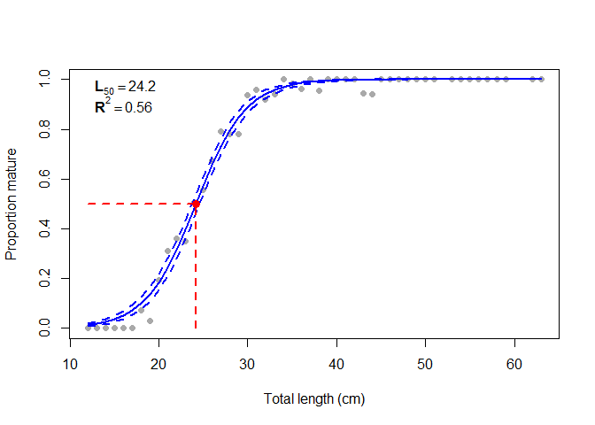

    #> Size at gonadal maturity = 24.2 
    #> Confidence intervals = 23.8 - 24.6 
    #> Rsquare = 0.56

The legend position can be modified.

``` r
plot(
  my_gonad,
  xlab = "Total length (cm)",
  ylab = "Proportion mature",
  col = c("blue", "red"),
  onlyOgive = TRUE,
  legendPosition = "bottomright"
)
```

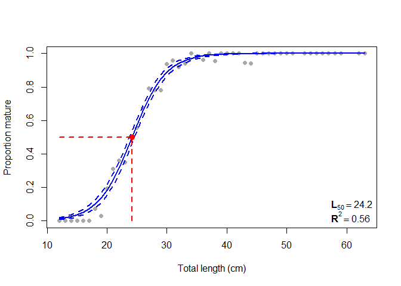

    #> Size at gonadal maturity = 24.2 
    #> Confidence intervals = 23.8 - 24.6 
    #> Rsquare = 0.56

The legend can be removed.

``` r
plot(
  my_gonad,
  xlab = "Total length (cm)",
  ylab = "Proportion mature",
  col = c("blue", "red"),
  onlyOgive = TRUE,
  showLegend = FALSE
)
```

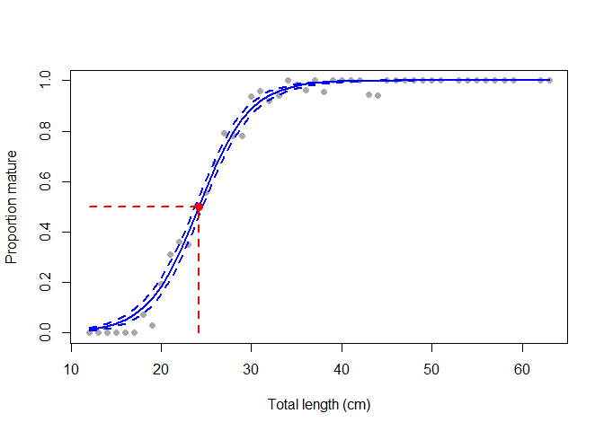

    #> Size at gonadal maturity = 24.2 
    #> Confidence intervals = 23.8 - 24.6 
    #> Rsquare = 0.56

### ggplot2-style maturity ogive

``` r
plot(
  my_gonad,
  xlab = "Total length (cm)",
  ylab = "Proportion mature",
  col = c("steelblue", "firebrick"),
  onlyOgive = TRUE,
  gg_style = TRUE
)
#> Size at gonadal maturity = 24.2 
#> Confidence intervals = 23.8 - 24.6 
#> Rsquare = 0.56
```


When `gg_style = TRUE` and `onlyOgive = FALSE`, the function returns a
list of independent `ggplot` objects.

``` r
p_gonad <- plot(
  my_gonad,
  xlab = "Total length (cm)",
  ylab = "Proportion mature",
  col = c("steelblue", "firebrick"),
  gg_style = TRUE
)
#> Size at gonadal maturity = 24.2 
#> Confidence intervals = 23.8 - 24.6 
#> Rsquare = 0.56

names(p_gonad)
#> [1] "A"     "B"     "L50"   "ogive"
```

Each plot can be displayed separately.

``` r
p_gonad$A
```

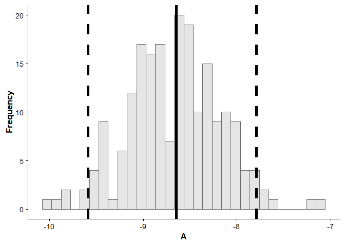

``` r
p_gonad$B
```

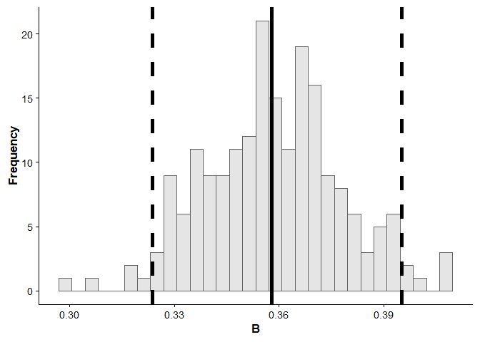

``` r
p_gonad$L50
```

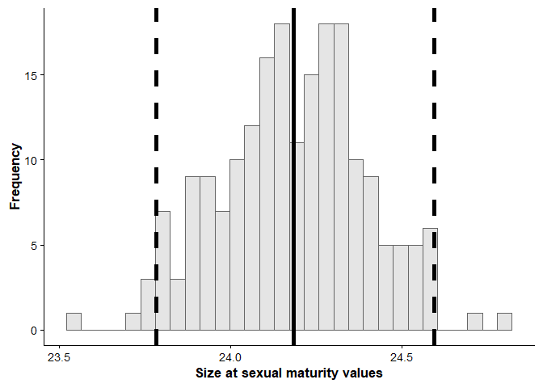

``` r
p_gonad$ogive
```

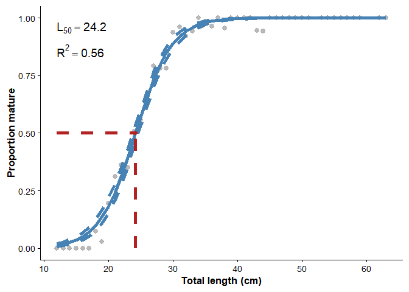

The returned plots can be customized using `ggplot2`.

``` r
p_gonad$ogive +
  ggplot2::theme_bw() +
  ggplot2::ggtitle("Gonadal maturity ogive")
```

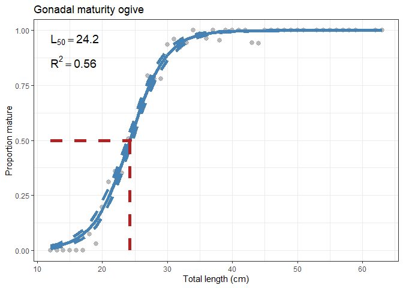

## Combining ggplot2-style outputs

The elements returned by `plot(..., gg_style = TRUE)` are standard
`ggplot` objects. They can be combined using external packages such as
`ggpubr` or `cowplot`.

``` r
ggpubr::ggarrange(
  p_gonad$A,
  p_gonad$B,
  p_gonad$L50,
  p_gonad$ogive,
  ncol = 2,
  nrow = 2
)
```


``` r
cowplot::plot_grid(
  p_gonad$A,
  p_gonad$B,
  p_gonad$L50,
  p_gonad$ogive,
  ncol = 2
)
```

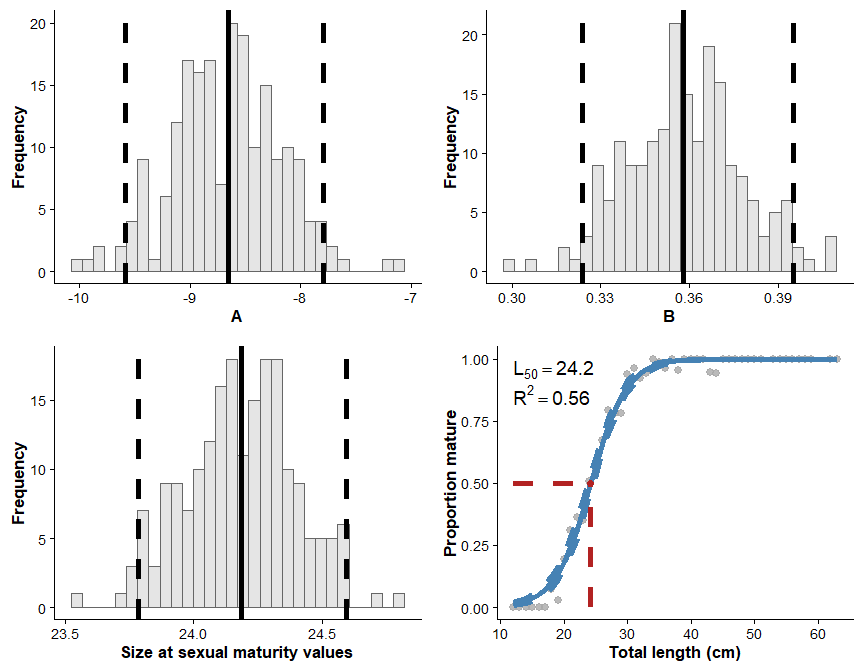

## Citation

To cite `sizeMat`, use:

``` r
citation("sizeMat")
#> To cite package 'sizeMat' in publications use:
#> 
#>   Torrejon-Magallanes J, Angeles-Gonzalez L (2026). _sizeMat: Estimate
#>   Size at Sexual Maturity_. R package version 1.1.3,
#>   <https://cran.r-project.org/package=sizeMat>.
#> 
#> A BibTeX entry for LaTeX users is
#> 
#>   @Manual{,
#>     title = {sizeMat: Estimate Size at Sexual Maturity},
#>     author = {Josymar Torrejon-Magallanes and Luis Angeles-Gonzalez},
#>     year = {2026},
#>     note = {R package version 1.1.3},
#>     url = {https://cran.r-project.org/package=sizeMat},
#>   }
```
